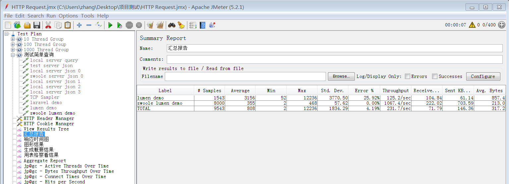
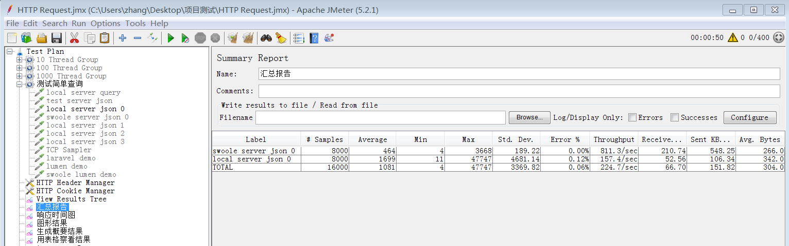

### php-pfm下的优化
关闭应用debug app.debug=false

缓存配置信息 php artisan config:cache

缓存路由信息 php artisan router:cache

类映射加载优化 php artisan optimize

自动加载优化 composer dumpautoload

根据需要只加载必要的中间件

使用即时编译器（JIT），如：HHVM、OPcache

使用 PHP 7.x

开启opcache

### 这些做法可以是qps翻倍，但是使用swoole可以再乘以4倍

